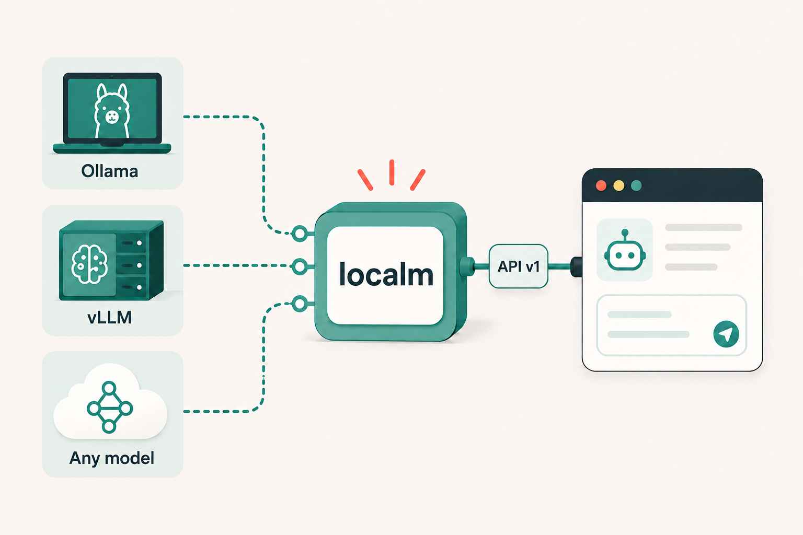

# LocalM

LocalM is a lightweight, open-source gateway that provides one dependable,
secure, OpenAI-compatible API for local, self-hosted, and explicitly configured
remote LLM providers.

[](https://github.com/usmhic/localm/actions/workflows/ci.yml)
[](LICENSE)



LocalM sits between clients and inference servers. It owns authentication,
allowlists, limits, capability checks, and routing; the provider still owns
model installation and inference. LocalM is intentionally not a model manager,
chat application, workflow builder, or agent runtime.

## What it provides

- One compatible client URL for Ollama, LM Studio, llama.cpp, LocalAI, vLLM,
  compatible cloud APIs, and custom servers.
- `POST /v1/chat/completions`, `POST /v1/responses`, `POST /v1/embeddings`, and
  `GET /v1/models`.
- Multiple named connections with deterministic model, capability, health, and
  priority routing.
- Authenticated, sanitized discovery through `GET /v1/capabilities`.
- Streaming and pass-through of compatible extension fields.
- Explicit checks for tools, structured output, reasoning, and image input.
- Client API-key authentication, model allowlists, request/token limits,
  per-key and per-IP rate limits, and bounded concurrency.
- A static, non-root production container with no application runtime
  dependencies.

LocalM does not store prompts, responses, embeddings, or credentials. It does
not enable telemetry or make background network calls. Public health and API
documentation routes do not expose connection details.

## How it works

```text
OpenAI-compatible client
        |
        v
LocalM: auth -> limits -> model/capability policy -> routing
        |
        +----> Ollama / LM Studio / llama.cpp
        +----> LocalAI / vLLM / compatible server
        +----> explicitly trusted remote connection
```

The highest-priority known-healthy connection that serves the requested model
and declares every required capability is selected. Unsupported feature fields
are rejected; LocalM never removes them silently. Successful compatible fields
pass through, while upstream error bodies are replaced with sanitized
OpenAI-style errors.

## Quick start with Ollama

Requirements: Docker and [Ollama](https://ollama.com/).

```bash
ollama run qwen3:8b
cp .env.example .env
```

Edit `.env` and set `API_KEYS` to a long, random value. The file is ignored by
Git and the Docker build context. Then start the gateway:

```bash
docker compose up -d
```

Compose binds LocalM to `127.0.0.1:8080` and uses Ollama on the Docker host by
default. Open <http://localhost:8080/docs/> or call the API using the same key:

```bash
curl http://localhost:8080/v1/chat/completions \
  -H "Authorization: Bearer ${LOCALM_API_KEY}" \
  -H "Content-Type: application/json" \
  -d '{"model":"qwen3:8b","messages":[{"role":"user","content":"Say hello."}]}'
```

Set `LOCALM_API_KEY` in your shell to the value placed in `API_KEYS`; it is only
a client-side variable in this example. LocalM reads the comma-separated
`API_KEYS` setting.

The Compose file pulls `ghcr.io/usmhic/localm:latest` when it is missing. Use
`docker compose up --build` to build the current checkout instead.

## Other providers

Legacy single-connection environment variables remain supported:

```dotenv
LLM_PROVIDER=lmstudio
UPSTREAM_BASE_URL=http://host.docker.internal:1234/v1
ALLOWED_MODELS=your-loaded-model-id
```

| Runtime | Provider value | Typical host URL |
| --- | --- | --- |
| Ollama | `ollama` | `http://localhost:11434/v1` |
| LM Studio | `lmstudio` | `http://localhost:1234/v1` |
| llama.cpp | `llamacpp` | `http://localhost:8080/v1` |
| LocalAI | `localai` | `http://localhost:8080/v1` |
| vLLM or compatible API | `custom` | Provider-specific `/v1` URL |

See [Provider setup](docs/providers.md) for runtime-specific notes.

## Multiple connections

Copy [localm.example.yaml](localm.example.yaml) to the ignored `localm.yaml`,
then set `LOCALM_CONFIG` to that file's path. Every connection model must also
appear in the global `ALLOWED_MODELS` environment setting.

```yaml
allow_remote: true
connections:
  local:
    provider: ollama
    base_url: http://localhost:11434/v1
    priority: 100
    trust: local
    models: [qwen3:8b]

  remote:
    provider: custom
    base_url: https://example.com/v1
    api_key_env: REMOTE_LLM_API_KEY
    priority: 50
    trust: remote
    models: [qwen3:8b]
    capabilities: [chat_completions, responses, embeddings, streaming]
```

Remote routing requires both `allow_remote: true` and `trust: remote`. Upstream
keys are referenced by environment-variable name and are never written inline
in YAML. Valid capabilities are `chat_completions`, `responses`, `embeddings`,
`streaming`, `tools`, `structured_output`, `reasoning`, and `vision`.

For Docker, mount the YAML file read-only as described in
[Deployment](docs/deployment.md).

## API

| Endpoint | Authentication | Purpose |
| --- | --- | --- |
| `POST /v1/chat/completions` | Bearer key | Chat, streaming, tools, and compatible extensions |
| `POST /v1/responses` | Bearer key | Responses API |
| `POST /v1/embeddings` | Bearer key | Embeddings API |
| `GET /v1/models` | Bearer key | Globally allowed models |
| `GET /v1/capabilities` | Bearer key | Sanitized connection/model capability discovery |
| `GET /healthz` | Public | Process liveness only |
| `GET /readyz` | Public | Aggregate readiness only |
| `GET /docs/` | Public | Swagger UI |
| `GET /openapi.json` | Public | Embedded OpenAPI document |

The full configuration reference is in
[docs/configuration.md](docs/configuration.md). The tracked
[.env.example](.env.example) lists every supported environment setting with
empty values so it is safe to copy and commit.

## Development

The Go version is pinned in [mise.toml](mise.toml) and the container builder.
Go 1.25 or newer is supported.

```bash
mise install
go mod download
gofmt -w *.go
go test -race ./...
go vet ./...
go build ./...
docker compose --no-interpolate config --quiet
docker build -t localm:test .
```

One CI workflow runs formatting, dependency verification, race-enabled tests,
static analysis, secret scanning, Compose validation, and a container smoke
test. Successful pushes to `dev` and `main` publish multi-architecture images to
GHCR.

## Contributing

Contributions are welcome when they keep LocalM small and gateway-focused.

1. Search existing issues and discuss large or boundary-changing work first.
2. Create a focused branch and avoid mixing unrelated cleanup into the change.
3. Add tests for new behavior, especially validation, upstream errors,
   cancellation, and streaming.
4. Update OpenAPI, examples, and operator documentation with public API or
   configuration changes.
5. Run the development checks above before opening a pull request.
6. Explain compatibility, security, and deployment impact in the pull request.

Never commit real or previously valid credentials, authorization headers,
private prompts, model output, internal URLs, customer data, `.env`, or local
connection files. Use unmistakably synthetic test values. If sensitive data is
committed, treat it as compromised, rotate it immediately, and report it
privately rather than attempting to hide it in a later commit.

Read [CONTRIBUTING.md](CONTRIBUTING.md) for the full workflow,
[SECURITY.md](SECURITY.md) for vulnerability reporting, and
[CODE_OF_CONDUCT.md](CODE_OF_CONDUCT.md) before participating.

## Documentation

- [Architecture and scaling](docs/architecture.md)
- [Configuration reference](docs/configuration.md)
- [Provider setup](docs/providers.md)
- [Deployment](docs/deployment.md)
- [Agent and tool-calling guide](docs/agents.md)
- [Engineering standards](STANDARDS.md)
- [Package naming](PACKAGE_NAMING.md) - public module, executable, and image identifiers
- [Coding-agent guide](AGENTS.md)

## License

LocalM is available under the [MIT License](LICENSE) and maintained by
[usmhic](https://github.com/usmhic).
